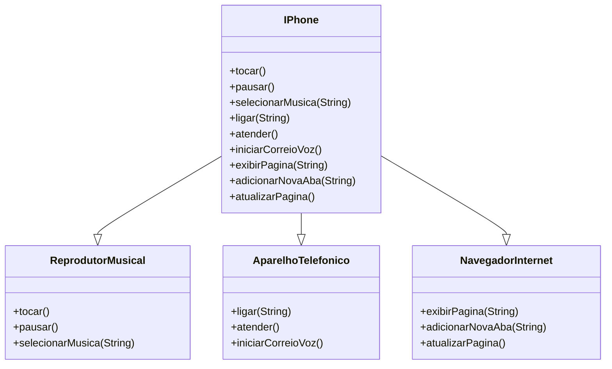

# UML

```mermaid
classDiagram
    class ReprodutorMusical{
        +tocar()
        +pausar()
        +selecionarMusica(String)
    }

    class AparelhoTelefonico{
        +ligar(String)
        +atender()
        +iniciarCorreioVoz()
    }

    class NavegadorInternet{
        +exibirPagina(String)
        +adicionarNovaAba(String)
        +atualizarPagina()
    }

    class IPhone{
        +tocar()
        +pausar()
        +selecionarMusica(String)
        +ligar(String)
        +atender()
        +iniciarCorreioVoz()
        +exibirPagina(String)
        +adicionarNovaAba(String)
        +atualizarPagina()
    }

    IPhone --|> ReprodutorMusical
    IPhone --|> AparelhoTelefonico
    IPhone --|> NavegadorInternet
```